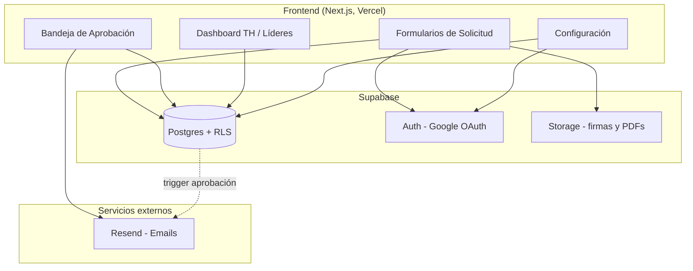
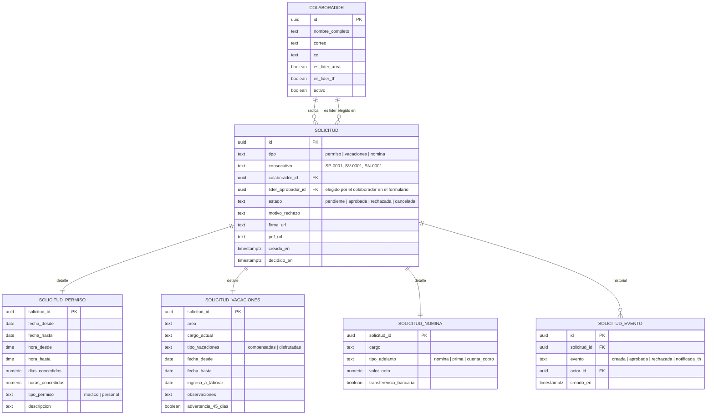
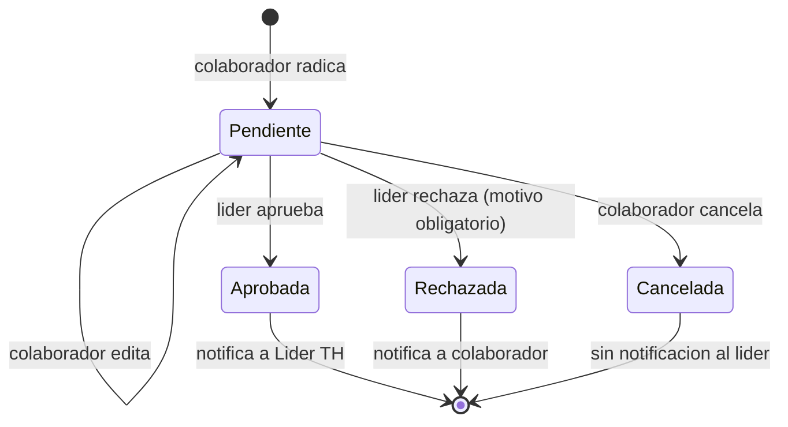

# SDD — Sistema de Solicitudes PIXEL GRAPHIC

## 1. Arquitectura propuesta y razones de elección

**Stack:** Next.js (App Router, React) + Supabase (Postgres, Auth, Storage) + Resend (emails transaccionales) + Vercel (hosting).

**Razones:**
- Supabase da Auth con Google OAuth, base de datos relacional con Row Level Security (RLS) y Storage en una sola plataforma — evita levantar backend propio para un sistema de este tamaño.
- RLS de Postgres permite modelar los permisos por rol (colaborador/líder/TH) directamente en la base de datos, no solo en el frontend — más seguro ante manipulación de requests.
- Next.js permite Server Actions/Route Handlers para generar PDFs y disparar emails sin exponer lógica sensible al cliente.
- Costo $0 en el tamaño actual (~25 colaboradores).

**Alternativa descartada:** backend propio (Node/Express + Postgres gestionado). Se descarta porque añade complejidad operativa (hosting de backend, gestión de sesiones) sin beneficio real dado el tamaño del equipo y el alcance Modular del MVP.

**Nota de decisión (2026-07-22):** el resto del ecosistema Pixel (TC Monitor, CRM, WFM) usa un stack distinto (Firebase + HTML/JS vanilla + GitHub Pages, ver `pixel-design-system.md`). Se decidió explícitamente **mantener Next.js + Supabase** para este proyecto en vez de alinearse a ese stack, porque ya fue auditado (RLS, constraints, triggers) y aprobado en Build Ready. Del design system de Pixel se adopta únicamente el **look and feel** (tokens de color, tipografía Space Grotesk/JetBrains Mono, radios, componentes visuales) traducido a CSS variables/Tailwind sobre Next.js — no su arquitectura de datos ni su hosting.

## 2. Componentes y responsabilidades

- **Frontend (Next.js)**: formularios, bandeja de aprobación, dashboard, configuración. Server Actions para escribir a Supabase y disparar generación de PDF/emails.
- **Supabase Auth**: login con Google OAuth (modo Externo, cualquier cuenta de Google puede intentarlo), restringido a lista blanca de correos (tabla `colaboradores`) como verdadero filtro de acceso.
- **Supabase Postgres + RLS**: fuente de verdad de datos y de permisos por fila.
- **Supabase Storage**: buckets para firmas subidas y PDFs generados.
- **Resend**: envío de correos de notificación (radicación, decisión, notificación a TH).

## 3. Modelo de datos y relaciones

Notas:
- No existe `colaborador.lider_id`: el líder de proceso no es fijo por colaborador. Cada `SOLICITUD` guarda su propio `lider_aprobador_id`, elegido por el colaborador de un desplegable con todos los `colaborador` donde `es_lider_area=true`, en el momento de radicar. Puede variar de una solicitud a otra.
- `es_lider_th` puede ser true para varios colaboradores simultáneamente — se removió la restricción de unicidad para permitir redundancia (varios Líderes de TH como respaldo entre sí) (v1.1).
- `SOLICITUD_EVENTO` es la tabla de auditoría/trazabilidad que alimenta el dashboard de historial.
- El consecutivo se genera con una secuencia por tipo (`SP`, `SV`, `SN`) que nunca se reinicia ni se reutiliza (ver reglas de negocio).

## 4. Estados y transiciones

No hay estados intermedios de revisión en el MVP. Mientras está en Pendiente, el propio colaborador puede editarla (sin cambiar de estado) o cancelarla (pasa a Cancelada, estado final). Una vez Aprobada, Rechazada o Cancelada, la solicitud es inmutable (reforzado por trigger, ver §6). Cada transición genera un registro en `SOLICITUD_EVENTO` y dispara el email correspondiente (cancelar no dispara email al líder, ya que aún no ha actuado).

**Generación del PDF (`pdf_url`)**: se genera una sola vez, en el momento en que la solicitud pasa a `Aprobada` o `Rechazada` — nunca al radicar. El PDF incluye los datos del formulario, la firma del colaborador, y además el resultado de la decisión (aprobada/rechazada), quién decidió y la fecha de decisión. No se genera PDF para `Pendiente` ni `Cancelada` — no hay nada que archivar todavía.

## 5. Autenticación, roles y permisos

- **Auth**: Google OAuth vía Supabase Auth (`signInWithOAuth({ provider: 'google' })`). El colaborador hace clic en "Iniciar sesión con Google", completa el consentimiento de Google, y vuelve a `/auth/callback` con un `code` que se intercambia por sesión (`exchangeCodeForSession`).

  **Nota de decisión (2026-07-23):** se evaluaron tres flujos de auth durante la construcción: (1) Google OAuth con el consent screen en modo "Interno" — descartado porque los colaboradores de Pixel Graphic están repartidos en **dos Workspaces de Google distintos y sin relación entre sí** (`pixel-g.com` y `pxl.com`), y "Interno" solo cubre un Workspace a la vez; (2) código OTP de 6 dígitos por correo — se implementó primero para no depender de Google Cloud Console (en un momento Alejo no tenía acceso), pero se abandonó en cuanto se consiguió acceso al Workspace, porque un botón de "Iniciar sesión con Google" es más simple para el usuario final que pedir un código; (3) **Google OAuth con consent screen en modo "Externo"** — la solución final. Con "Externo", cualquier cuenta de Google puede completar el login, pero el filtro real de acceso sigue siendo la lista blanca de la tabla `colaboradores` (validada en `/auth/callback` inmediatamente después del intercambio de sesión, vía `fn_correo_autorizado`); si el correo no está autorizado, se cierra la sesión recién creada y se redirige a login con un mensaje claro. Esto significa que la seguridad real nunca dependió de la restricción de dominio de Google — siempre fue la tabla `colaboradores`, consistente con el resto de la arquitectura (RLS, constraints).
- **Roles derivados de datos, no de un enum separado**: un colaborador es "líder de área" si `es_lider_area=true`, es "Líder de TH" si `es_lider_th=true`. Estos flags se gestionan desde el módulo de Configuración.
- **Permisos (RLS en Postgres):**
  - Un colaborador puede leer/crear solo sus propias solicitudes, y solo puede actualizar (editar) o cancelar las suyas mientras estén en estado Pendiente.
  - Un líder de área puede leer y actualizar (aprobar/rechazar) las solicitudes donde `lider_aprobador_id = su_id` — este es también el criterio para su bandeja de aprobación y su vista de dashboard ("mi equipo" = solicitudes donde él fue el líder elegido, no un equipo fijo).
  - El Líder de TH puede leer todas las solicitudes y escribir en la tabla `colaboradores` (alta/baja, marcar/desmarcar líderes de área, elegir Líder de TH).
  - Nadie puede modificar un `consecutivo` una vez asignado.

## 6. Validaciones y reglas detalladas

**En base de datos (fuente de verdad, no solo frontend):**
- `CHECK (lider_aprobador_id <> colaborador_id)` en `SOLICITUD` — bloquea autoaprobación a nivel de constraint, no solo ocultando la opción en el desplegable.
- `CHECK` que exige `motivo_rechazo IS NOT NULL AND motivo_rechazo <> ''` cuando `estado = 'rechazada'`.
- Trigger `BEFORE UPDATE` en `SOLICITUD` que rechaza cualquier cambio si el estado actual (antes del update) no es `pendiente` — implementa la inmutabilidad real de Aprobada/Rechazada/Cancelada.
- RLS de columna: la política de `UPDATE` para un líder de área solo permite modificar `estado`, `motivo_rechazo`, `decidido_en` — nunca los campos del formulario ni `colaborador_id`. La política de `UPDATE` para el propio colaborador (edición en pendiente) permite los campos del formulario pero no `estado`, `lider_aprobador_id` tras creación, ni `consecutivo`.
- `CHECK (valor_neto > 0)` en `SOLICITUD_NOMINA`.
- Consecutivo generado con `nextval()` de una secuencia Postgres dedicada por tipo (`seq_sp`, `seq_sv`, `seq_sn`), nunca calculado con `max()+1` en la aplicación — evita duplicados bajo concurrencia. Pueden quedar huecos en la numeración (por cancelaciones/rechazos); eso es aceptable, duplicados no.

**En Server Action / frontend (UX, no la garantía de seguridad):**
- El formulario captura `lider_aprobador_id` de un desplegable poblado con `colaborador` donde `es_lider_area=true`, excluyendo siempre al colaborador autenticado. Si no hay ninguno elegible, bloquea el envío con mensaje explicativo.
- Área y Cargo (Permiso/Vacaciones/Nómina) se eligen de las tablas catálogo `AREA`/`CARGO` (con soft-delete vía `activo`), pero se guardan como texto congelado en `SOLICITUD_PERMISO`/`SOLICITUD_VACACIONES`/`SOLICITUD_NOMINA` al momento de radicar — no son FK vivas ni existen como columnas en `COLABORADOR` (v1.1).
- Vacaciones: si `fecha_desde - creado_en < 45 días`, se guarda `advertencia_45_dias = true` pero no se bloquea el insert.
- Firma (`firma_url`) es obligatoria para pasar de borrador a "Pendiente" (no existe estado borrador persistido en el MVP — se valida en frontend antes de enviar).
- Solo se puede transicionar a `cancelada` desde `pendiente`, y solo por el propio `colaborador_id` de la solicitud (reforzado también por RLS de fila).

## 7. Contratos entre frontend y servicios
- Frontend usa el cliente de Supabase (JS) directamente para lecturas protegidas por RLS.
- Escrituras sensibles (crear solicitud, decidir aprobación, generar PDF, disparar email) pasan por **Server Actions de Next.js**, que usan el **token de sesión del usuario autenticado, nunca la service role key**. RLS aplica también a estas escrituras — la Server Action orquesta (generar PDF, llamar a Resend) pero no es la fuente de la seguridad.
- Las reglas de negocio críticas están duplicadas a propósito en dos capas: la Server Action da mensajes de error claros al usuario, pero la garantía real está en constraints/triggers de la base de datos (ver §6). Si la Server Action tuviera un bug o se accediera por otra vía, la base de datos sigue rechazando la operación inválida.

## 8. Integraciones y dependencias externas
- **Google OAuth** (vía Supabase Auth, consent screen en modo Externo — ver nota de decisión en §5).
- **Resend** para envío de correos.
- Sin integración con nómina/ERP en el MVP (fuera de alcance, confirmado en PRD).

## 9. Manejo de errores, casos vacíos y excepciones
- Login con correo no autorizado → mensaje claro "tu correo no tiene acceso, contacta a Talento Humano", sin crear sesión.
- Fallo al enviar email (Resend caído) → la transición de estado en base de datos **no se revierte**. No hay reintento automático en el MVP (decisión aceptada: no se monta infraestructura de colas/cron para este volumen). Se deja registro en `SOLICITUD_EVENTO` marcado como fallido, visible para TH, con un botón de "reenviar notificación" manual en el dashboard.
- Dashboard sin resultados tras filtrar → estado vacío explícito ("no hay solicitudes con estos filtros").
- Colaborador intenta radicar sin líder asignado → bloqueado con mensaje explicativo, no error genérico.
- TH intenta desactivar a un colaborador o quitarle `es_lider_area` mientras tiene solicitudes en `Pendiente` donde es `lider_aprobador_id` → el sistema **bloquea la acción** y muestra la lista de solicitudes pendientes que debe resolverse primero (esperando decisión o reasignación manual del colaborador solicitante cancelando y volviendo a radicar).
- "Eliminar" un colaborador desde Configuración nunca es un borrado físico (`DELETE`): siempre es `activo=false` (soft-delete). Se mantiene el registro para no romper la integridad referencial de solicitudes históricas ni violar la retención indefinida.

## 10. Seguridad, privacidad, respaldo y auditoría
- RLS en todas las tablas — ninguna tabla es de acceso público sin política.
- Storage de firmas/PDFs con buckets privados; acceso vía URLs firmadas de corta duración, no públicas permanentes.
- Datos sensibles (CC, valor de adelantos) solo visibles para el propio colaborador, su líder directo y TH.
- `SOLICITUD_EVENTO` funciona como bitácora de auditoría (quién hizo qué y cuándo).
- Respaldo: backups automáticos diarios de Supabase (incluidos en el plan free con retención limitada; evaluar upgrade si se requiere retención larga más adelante).
- Retención de datos: indefinida por defecto, sin borrado automático (confirmado en PRD).

## 11. Requisitos no funcionales
- **Rendimiento**: carga de dashboard < 2s para volúmenes esperados (~25 colaboradores, cientos de solicitudes/año).
- **Disponibilidad**: dependiente de SLA de Supabase/Vercel free tier (suficiente para uso interno de una empresa pequeña).
- **Escalabilidad**: no es requisito crítico al tamaño actual; el modelo soporta crecimiento moderado sin cambios estructurales.
- **Accesibilidad**: formularios usables por teclado, contraste adecuado, responsive real (uso desde celular confirmado como requisito).

## 12. Ambientes, despliegue, migraciones y observabilidad
- Un solo ambiente de producción en el MVP (dado el tamaño y criticidad del proyecto, nivel Modular). Se recomienda un proyecto Supabase de *staging* separado antes de cambios grandes futuros, pero no es bloqueante para el MVP.
- Migraciones de base de datos versionadas con Supabase CLI (`supabase/migrations`).
- Observabilidad: logs de Vercel + logs de Supabase; sin herramienta de monitoreo externa en el MVP.

## 13. Estrategia de pruebas
- Pruebas manuales guiadas por los criterios de aceptación del PRD (por corte vertical).
- Pruebas de RLS: verificar explícitamente que un colaborador no puede leer/escribir solicitudes ajenas, y que un líder no puede aprobar solicitudes fuera de su equipo.
- Prueba de flujo completo end-to-end (radicar → aprobar → notificar TH → verse en dashboard) antes de liberar cada tipo de solicitud.

## 14. Decisiones técnicas, alternativas descartadas y deuda aceptada
- **Decisión**: reglas de permisos en RLS de Postgres en vez de solo en el frontend. Razón: seguridad real ante manipulación de requests. Consecuencia: más cuidado al escribir políticas SQL.
- **Decisión**: sin estado "borrador" persistido — se valida todo en frontend antes de insertar como "Pendiente". Deuda aceptada: si el navegador se cierra a medio llenar el formulario, se pierde el progreso (aceptable para el MVP).
- **Decisión**: un solo ambiente de producción. Deuda aceptada: cambios futuros se prueban con cuidado manual, no en staging aislado, hasta que el proyecto lo justifique.
- **Alternativa descartada**: aprobación multinivel desde el inicio — se deja para fase futura (PRD sección 13) para no sobre-diseñar el MVP.
