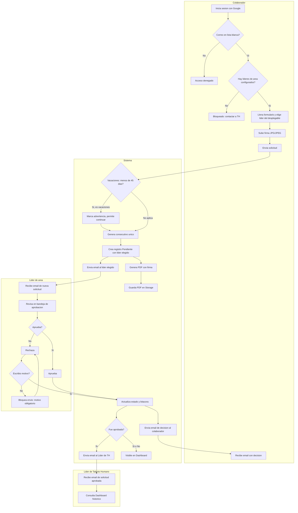

# Diagrama de flujo con carriles por actor — Ciclo de una Solicitud

## Casos alternativos y de error cubiertos
- Correo fuera de la lista blanca → acceso denegado, sin crear sesión.
- No hay líderes de área configurados → bloqueado antes de poder enviar el formulario (el líder se elige por solicitud, no es un dato fijo del colaborador).
- Vacaciones radicadas con menos de 45 días de anticipación → advertencia visible, no bloqueo (decisión conjunta líder + TH ya en PRD).
- Rechazo sin motivo → el sistema no permite confirmar el rechazo hasta que se escriba el motivo.
- Toda decisión (aprobada o rechazada) queda en `SOLICITUD_EVENTO` y es visible en el Dashboard correspondiente según rol.
