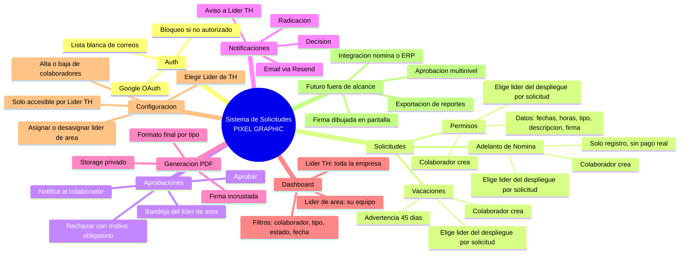

# Mapa mental de módulos — Sistema de Solicitudes PIXEL GRAPHIC

## Notas
- Los 3 tipos de solicitud comparten el mismo ciclo (Auth → Solicitudes → Aprobaciones → Notificaciones → PDF → Dashboard), solo cambian los campos propios de cada formulario.
- Configuración es el único módulo exclusivo del Líder de TH.
- Dashboard tiene dos vistas con el mismo componente pero alcance de datos distinto según rol (RLS ya definido en el SDD).
